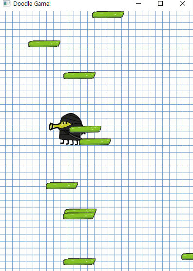

## DoodleJump
Doodle Jump is a platform jumping game.
The project was formerly referred by https://www.youtube.com/channel/UCC7qpnId5RIQruKDJOt2exw



## Getting Started

### Prerequisites
* cmake
* a C++11-standard-compliant compiler
* python
* pip
* conan
```sh
pip install conan
pip install pyopenssl
# Add python script path to environment variables
conan remote add bincrafters https://api.bintray.com/conan/bincrafters/public-conan
```

### Installation
#### For windows
Clone and run the build:
```sh
git clone https://github.com/silverthreadk/DoodleJump.git
mkdir build && cd build

#Debug
conan install .. -s build_type=Debug -s compiler.runtime=MTd
#Release
conan install .. -s build_type=Release -s compiler.runtime=MT

cmake -DCMAKE_GENERATOR_PLATFORM=x64 ../
cmake --build ./ --
```
